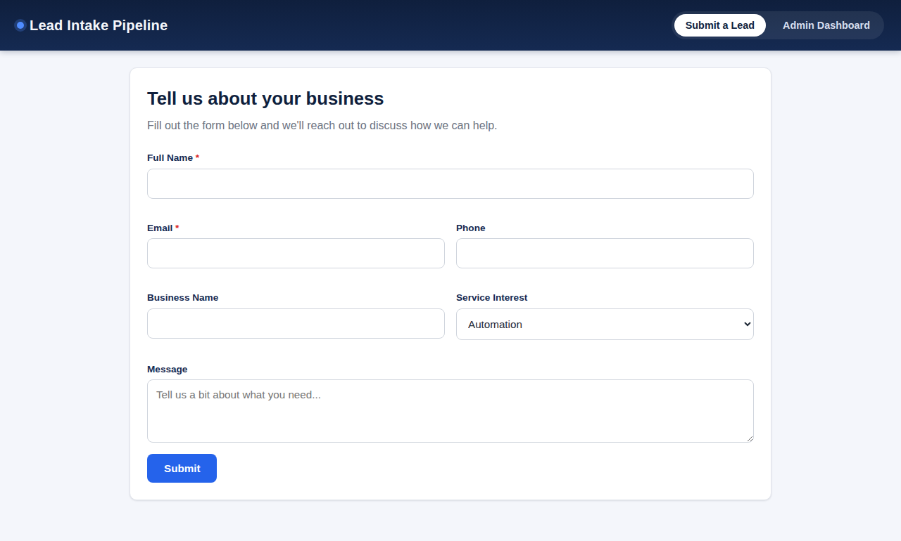
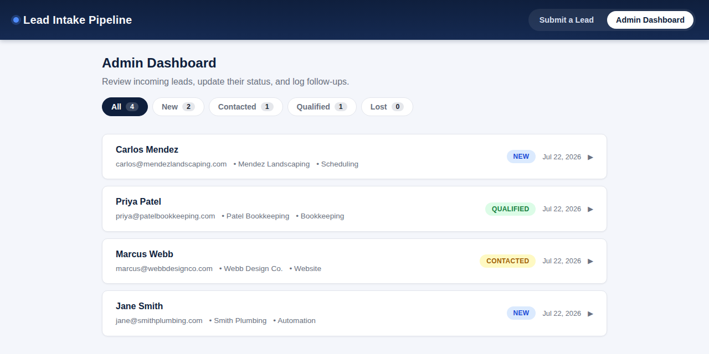
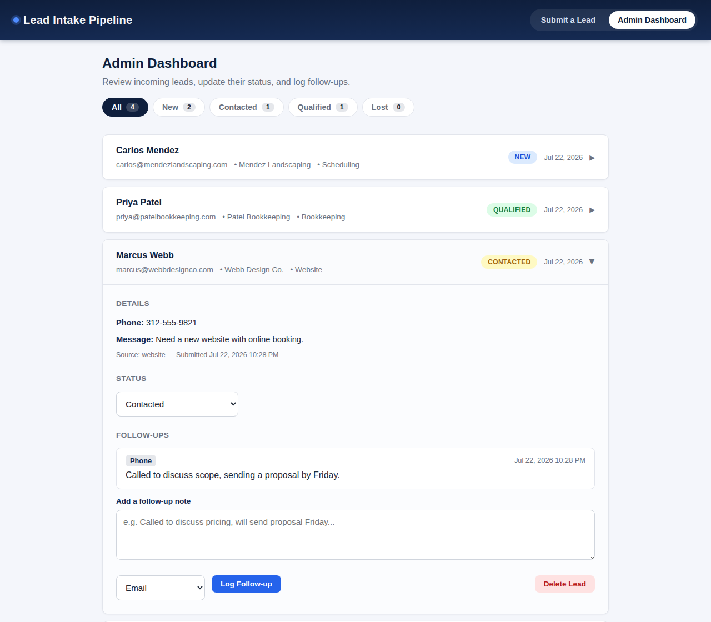

# Lead Intake Pipeline

Lead Intake Pipeline is a lightweight web application that helps small businesses capture new sales leads through a public intake form and manage the follow-up process from a simple admin dashboard. Every submission is persisted to PostgreSQL, and staff can track lead status, log follow-up activity, and review a complete history for each lead without leaving the browser.

## Screenshots

**Public intake form**



**Admin dashboard**



**Expanded lead detail**



## Features

- Public lead intake form for capturing new prospects
- Admin dashboard with status filters and lead counts
- Expandable lead detail view for reviewing a lead at a glance
- Follow-up logging with contact method and note
- Lead deletion with a confirmation step, cascading to its follow-ups
- PostgreSQL persistence for leads and follow-up history

## Stack

- **Backend:** Node.js with Express
- **Database:** PostgreSQL
- **Frontend:** Vanilla HTML, CSS, and JavaScript with no build step

## Setup

1. Clone the repo:
   ```bash
   git clone https://github.com/NovaVey/lead-intake-pipeline.git
   cd lead-intake-pipeline
   ```
2. Install dependencies:
   ```bash
   npm install
   ```
3. Configure environment variables:
   ```bash
   cp .env.example .env
   ```
   Then edit `.env` and fill in `DATABASE_URL` for your PostgreSQL instance.
4. Initialize the database (creates the required tables):
   ```bash
   npm run db:init
   ```
5. Start the app:
   ```bash
   npm run dev
   ```
   (or `npm start` for production)

   Then open [http://localhost:3000](http://localhost:3000) in your browser.

## Deployment

The app deploys to [Railway](https://railway.com) with no custom build configuration — Railway auto-detects a Node app from `package.json` and runs `npm install` then `npm start`.

1. Prerequisites: a Railway account, and a `DATABASE_URL` for a reachable Postgres instance (this project uses Supabase — the same value you're using locally in `.env`).
2. In the Railway dashboard: **New Project → Deploy from GitHub repo**, and select this repository.
3. In the service's **Variables** tab, add `DATABASE_URL` with your Postgres connection string. Railway automatically injects its own `PORT` into the container even if you never set one yourself — do not add a `PORT` variable manually.
4. Once deployed, check the **Deploy/Runtime Logs** for the line `Lead Intake Pipeline server listening on port ...` to see the actual port Railway assigned (commonly `8080`, but treat whatever the log shows as the source of truth). Then go to **Settings → Networking → Public Networking → Generate Domain**, and set **Target port** to match that exact number — Railway pre-fills this field with its own default guess (usually already correct), so in most cases you can leave it as-is, but always cross-check it against the log rather than assuming. This step (generating the domain) is required and easy to miss — unlike some other hosts, Railway does not assign a public URL automatically.
5. No `/health` endpoint is needed: with no custom healthcheck path configured, Railway considers the deployment healthy as soon as the container starts.

Note: `.nvmrc` is included as a courtesy for local development with `nvm`, but Railway itself does not read it — only the `engines.node` field in `package.json` affects the Railway build.

## API Endpoints

| Method | Endpoint | Description |
| --- | --- | --- |
| GET | `/api/leads` | List all leads (supports `?status=` filter) |
| GET | `/api/leads/:id` | Get one lead with its follow-ups |
| POST | `/api/leads` | Create a new lead (`name`, `email` required) |
| PATCH | `/api/leads/:id/status` | Update a lead's status |
| POST | `/api/leads/:id/follow-ups` | Add a follow-up note to a lead |
| DELETE | `/api/leads/:id` | Delete a lead and its follow-ups |

## License

MIT © NovaVey
