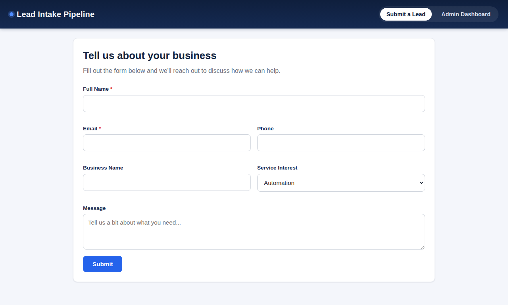
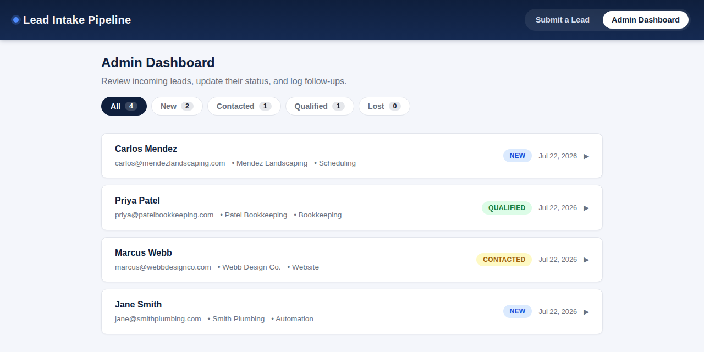
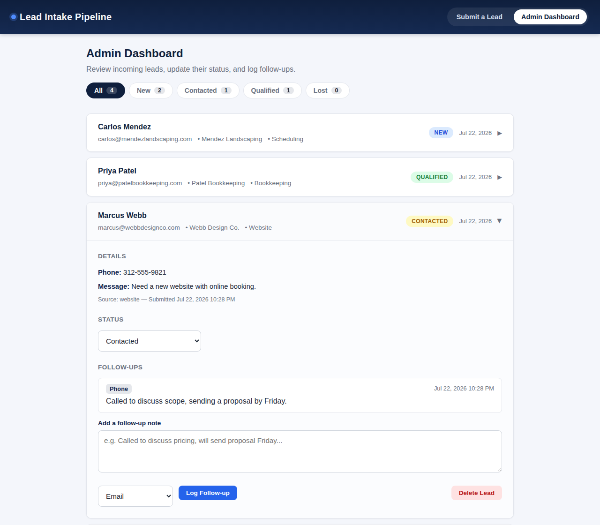
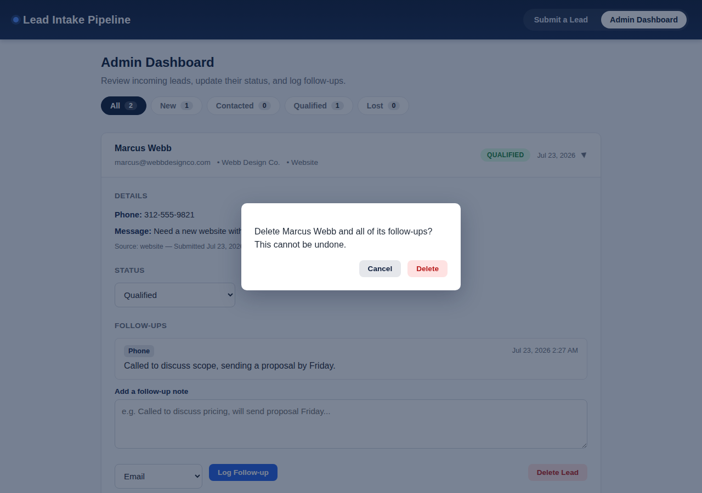

# Lead Intake Pipeline

Lead Intake Pipeline is a lightweight web application that helps small businesses capture new sales leads through a public intake form and manage the follow-up process from a simple admin dashboard. Every submission is persisted to PostgreSQL, and staff can track lead status, log follow-up activity, and review a complete history for each lead without leaving the browser.

## Screenshots

**Demo video**

<video src="docs/demo-video.mp4" controls width="700">Demo video showing lead submission, status filtering, expanding a lead, changing status, logging a follow-up, and deleting a lead.</video>

**Public intake form**



**Admin dashboard**



**Expanded lead detail**



**Delete confirmation**



## Features

- Public lead intake form for capturing new prospects
- Password-protected admin dashboard (single shared admin password — see Authentication below)
- Status filters and live lead counts
- Expandable lead detail view for reviewing a lead at a glance, fully keyboard-accessible
- Follow-up logging with contact method and note
- Lead deletion with a confirmation step, cascading to its follow-ups
- PostgreSQL persistence for leads and follow-up history

## Authentication

The **public intake form** (`POST /api/leads`) requires no login — anyone can submit a lead, which is the point.

Everything else — viewing, filtering, updating, and deleting leads via the admin dashboard — requires logging in with a single shared admin password (`ADMIN_PASSWORD`, set as an environment variable; see Setup and Deployment below). There are no individual user accounts; this is intentionally a lightweight, single-admin scheme rather than a full multi-user auth system, appropriate for a small business with one or a few staff sharing one password.

On login, the server issues an HttpOnly, signed session cookie (24-hour expiry) — there's no session table or external auth provider involved. If the session expires while you're on the dashboard, you'll be returned to the login screen automatically on the next action.

## Stack

- **Backend:** Node.js with Express
- **Database:** PostgreSQL
- **Frontend:** Vanilla HTML, CSS, and JavaScript with no build step

## Setup

1. Clone the repo:
   ```bash
   git clone https://github.com/NovaVey/lead-intake-pipeline.git
   cd lead-intake-pipeline
   ```
2. Install dependencies:
   ```bash
   npm install
   ```
3. Configure environment variables:
   ```bash
   cp .env.example .env
   ```
   Then edit `.env` and fill in `DATABASE_URL` for your PostgreSQL instance, and set `ADMIN_PASSWORD` to a password of your choosing (this is what you'll use to log into the admin dashboard).
4. Initialize the database (creates the required tables):
   ```bash
   npm run db:init
   ```
5. Start the app:
   ```bash
   npm run dev
   ```
   (or `npm start` for production)

   Then open [http://localhost:3000](http://localhost:3000) in your browser. Submitting a lead works immediately; click **Admin Dashboard** and log in with the `ADMIN_PASSWORD` you set to see it.

## Testing

Automated tests cover all 8 API routes (intake, auth, and the admin CRUD/follow-up endpoints), including validation errors, the auth-gating on every admin route, and the database-level CHECK/foreign-key constraints.

```bash
npm test
```

This runs against whatever `DATABASE_URL` is set in your environment and **truncates the `leads`/`follow_ups` tables before each test** — always point it at a scratch/local database, never at a database with real data you care about. `ADMIN_PASSWORD` doesn't need to be set beforehand; the test suite falls back to a fixed test value if it's missing.

Tests also run automatically in CI (GitHub Actions, `.github/workflows/test.yml`) against a disposable Postgres service container on every push and pull request.

## Deployment

The app deploys to [Railway](https://railway.com) with no custom build configuration — Railway auto-detects a Node app from `package.json` and runs `npm install` then `npm start`.

1. Prerequisites: a Railway account, and a `DATABASE_URL` for a reachable Postgres instance (this project uses Supabase — the same value you're using locally in `.env`).
2. In the Railway dashboard: **New Project → Deploy from GitHub repo**, and select this repository.
3. In the service's **Variables** tab, add:
   - `DATABASE_URL` — your Postgres connection string.
   - `ADMIN_PASSWORD` — the password for logging into the admin dashboard. **Required** — without it, admin login is disabled entirely (the login form will always fail with a 503) even though the public intake form keeps working.
   - `NODE_ENV=production` — recommended. This makes the session cookie `secure` (HTTPS-only), which is only correct once the app is served over HTTPS, as Railway does.

   Railway automatically injects its own `PORT` into the container even if you never set one yourself — do not add a `PORT` variable manually.
4. Once deployed, check the **Deploy/Runtime Logs** for the line `Lead Intake Pipeline server listening on port ...` to see the actual port Railway assigned (commonly `8080`, but treat whatever the log shows as the source of truth). Then go to **Settings → Networking → Public Networking → Generate Domain**, and set **Target port** to match that exact number — Railway pre-fills this field with its own default guess (usually already correct), so in most cases you can leave it as-is, but always cross-check it against the log rather than assuming. This step (generating the domain) is required and easy to miss — unlike some other hosts, Railway does not assign a public URL automatically.
5. No `/health` endpoint is needed: with no custom healthcheck path configured, Railway considers the deployment healthy as soon as the container starts.

Note: `.nvmrc` is included as a courtesy for local development with `nvm`, but Railway itself does not read it — only the `engines.node` field in `package.json` affects the Railway build.

## API Endpoints

| Method | Endpoint | Auth required | Description |
| --- | --- | --- | --- |
| POST | `/api/leads` | No | Create a new lead (`name`, `email` required) |
| GET | `/api/leads` | Yes | List leads (supports `?status=` and `?search=` filters) |
| GET | `/api/leads/:id` | Yes | Get one lead with its follow-ups |
| PATCH | `/api/leads/:id/status` | Yes | Update a lead's status |
| POST | `/api/leads/:id/follow-ups` | Yes | Add a follow-up note to a lead |
| PATCH | `/api/leads/:id/follow-ups/:followUpId` | Yes | Mark a follow-up complete/incomplete |
| DELETE | `/api/leads/:id` | Yes | Delete a lead and its follow-ups |
| POST | `/api/auth/login` | No | Log in with `{ password }`, sets the session cookie |
| POST | `/api/auth/logout` | No | Clear the session cookie |
| GET | `/api/auth/me` | No | Check current login status (`{ authenticated: boolean }`) |

`POST /api/leads` and `POST /api/auth/login` are both rate-limited per IP (20 submissions / 10 login attempts per 15 minutes) since neither requires auth to call.

## Environment variables

| Variable | Required | Description |
| --- | --- | --- |
| `DATABASE_URL` | Yes | PostgreSQL connection string |
| `ADMIN_PASSWORD` | Yes, for admin login | Shared password for the admin dashboard. Without it, `POST /api/auth/login` always returns 503 — the public intake form still works. |
| `PORT` | No | Defaults to `3000` locally. Railway injects its own at runtime — see Deployment. |
| `NODE_ENV` | No | Set to `production` on any real deployment so the session cookie is issued with `secure: true` (HTTPS-only) and request logging switches to the `combined` (Apache-style) format. |

## Architecture

A single Express process serves both the API and the static frontend — there's no separate frontend build/deploy step or client-side framework. Requests flow: browser → Express → `pg` connection pool → PostgreSQL. The admin dashboard is a single HTML page that fetches JSON from `/api/leads*` and re-renders in place; there's no client-side router beyond showing/hiding views.

```
Public visitor ──POST /api/leads──▶ Express ──▶ PostgreSQL (leads, follow_ups)
                                        ▲
Admin (logged in) ──GET/PATCH/DELETE───┘
                     (session cookie required)
```

## Known limitations

This is a portfolio-scale project, not a production SaaS — a few things are intentionally simple:

- **Single shared admin password**, not per-user accounts. Fine for one or a few staff who already trust each other; not appropriate if you need per-user audit trails or revocable access.
- **No email uniqueness constraint** on leads — the same person can submit the intake form more than once and each submission becomes its own lead row, rather than being merged or deduplicated. This is by design: two genuine inquiries from the same address (weeks apart, different service interest) shouldn't silently overwrite each other, and a real deduplication feature would need a UI for reviewing/merging matches rather than a blind uniqueness constraint.
- **No pagination** — `GET /api/leads` returns up to 500 rows in one response. That comfortably covers a small business's lead volume; a higher-traffic deployment would need cursor-based pagination instead of the hard cap.
- **No file attachments** on leads or follow-ups.
- **No outbound email/SMS** — follow-ups are logged manually; the app doesn't send anything on a business's behalf.

## License

MIT © NovaVey
